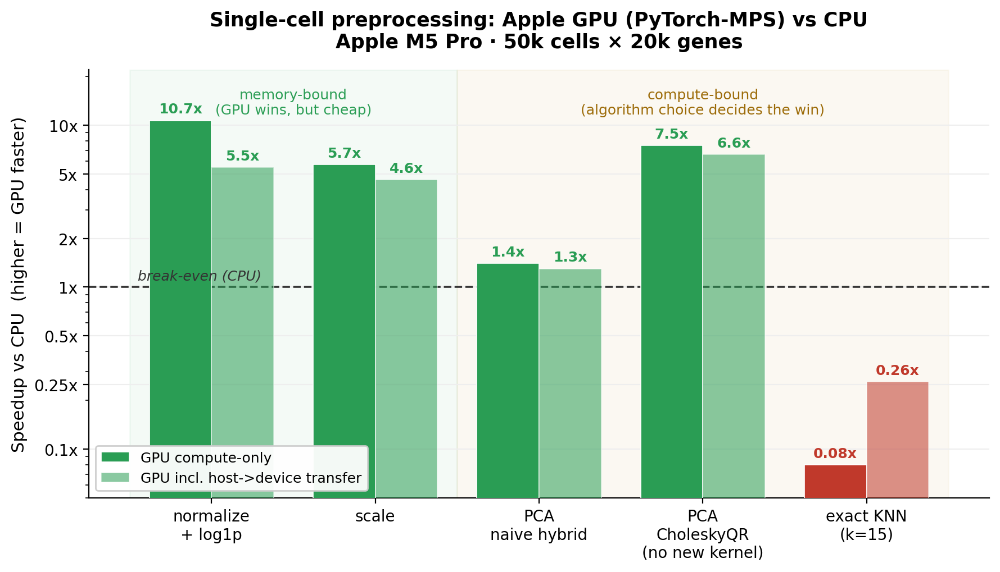

# Single-cell preprocessing on the Apple GPU: a feasibility benchmark

**Can you accelerate a single-cell RNA-seq preprocessing pipeline on an Apple
Silicon GPU (Metal), the way [rapids-singlecell](https://github.com/scverse/rapids-singlecell)
does on NVIDIA GPUs with RAPIDS/CUDA?**

Short answer, measured on an **Apple M5 Pro**: **mostly not, today** — for a
reason more interesting than "Macs are slow" — **but with one important exception
that emerged from this work: PCA, done with the right algorithm, runs ~7.5× faster
on the GPU with no custom Metal kernel** (see [Update](#update-pca-is-gpu-accelerable-after-all)).
This repo contains the standalone, reproducible benchmark and probes behind it.

> Origin: this started as a feasibility study for porting rapids-singlecell to
> Apple GPUs. It is **not** affiliated with that project and is not intended as a
> pull request — it's published for general interest because the findings about
> the Apple-GPU numerical stack apply to any array-heavy scientific workload.

## TL;DR



| Step | Bound by | CPU (scanpy/sklearn) | Apple GPU (PyTorch-MPS) | |
|---|---|--:|--:|--|
| normalize_total + log1p | memory | 161 ms | **15 ms (10.7×)** | GPU wins |
| scale (z-score + clip) | memory | 157 ms | **28 ms (5.7×)** | GPU wins |
| PCA — naive (Gram + CPU eig) | compute | 321 ms | 230 ms (1.4×) | ~wash |
| **PCA — CholeskyQR rSVD** | compute | 365 ms | **49 ms (7.5×)** | **GPU wins** ⭐ |
| exact KNN (k=15) | compute | 581 ms | 6867 ms (0.08×) | **GPU loses** |

⭐ The CholeskyQR row is the [Update](#update-pca-is-gpu-accelerable-after-all) finding — same data, a smarter algorithm, no new kernel.

*(MPS = kernel time with data resident on the GPU; transfer-inclusive numbers and
methodology are in [RESULTS.md](RESULTS.md).)*

**The result inverts the naive expectation.** You'd guess the cheap elementwise
steps wouldn't benefit (the CPU and GPU share one unified-memory bandwidth pool)
and the heavy linear-algebra steps would. The opposite happened:

- The **cheap elementwise steps won big** — but mostly because scanpy's CPU path
  is effectively single-threaded, and the absolute savings (~150 ms → ~30 ms) are
  trivial in a real pipeline.
- The **expensive steps that dominate runtime — PCA, neighbors, UMAP, clustering**
  — hit a wall: there is **no GPU eigendecomposition / SVD / QR on Apple Silicon
  today**, in *either* major framework:

  | routine | PyTorch-MPS 2.12 | MLX 0.31 |
  |---|---|---|
  | `qr` (tall) | **hangs** | CPU-only (`ValueError`) |
  | `svd` | silent CPU fallback | CPU-only (`ValueError`) |
  | `eigh` | `NotImplementedError` | CPU-only (`ValueError`) |
  | `pca_lowrank` | **hangs** | n/a |

So the blocker is not unified-memory bandwidth and not the choice of framework —
it's a **gap in the Apple-GPU numerical stack**. But that gap turns out to be
*routable* for some workloads — see the Update below.

## Update: PCA is GPU-accelerable after all

The original conclusion ("PCA is a wash on Apple GPU") was true for the *naive*
algorithm and **wrong for the right one** — exactly the kind of thing a benchmark
should surface.

Although MPS has no `eigh`/`svd`/`qr`, it **does** have `cholesky` (~5 ms for
2000×2000), `solve_triangular`, and fast `matmul`. Those three are enough to build
a QR factorization on the GPU via **Cholesky-QR** (`Q = Y · chol(YᵀY)⁻¹`), which is
enough to build a **randomized SVD almost entirely on the GPU**. The only off-GPU
step is a trivial `(k+p)×(k+p)` (~60×60) eigendecomposition on the CPU — microseconds.

Result on the M5 Pro (50k×2000, 50 components): **7.5× vs sklearn randomized PCA**
(6.6× including host→device), leading singular values matching to **~3e-4**, **no
custom Metal kernel required**. See [`pca_gpu_rsvd.py`](pca_gpu_rsvd.py).

What this changes — and what it doesn't:

- **PCA / truncated low-rank SVD / spectral embedding: feasible today**, ~1 day of
  work, no kernel writing. The earlier "compute-bound = blocked" claim was too broad.
- **A general drop-in `torch.linalg.svd`/`eigh` on the GPU** (all singular values,
  ill-conditioned inputs) is still a real but **bounded** project — a Metal one-sided
  Jacobi SVD / two-sided Jacobi eigh, slotted in via `torch.mps.compile_shader()`.
- **Exact KNN still loses on the GPU** here; approximate neighbors and graph
  clustering (cuGraph-equivalents) remain genuinely missing on Metal.

Caveats: Cholesky-QR squares the condition number, so we run it twice
(**CholeskyQR2**) for stability — still cheap, still on the GPU. Randomized SVD's
accuracy on the *weakest* of the 50 components is looser (~15%); the leading ones
are essentially exact, and more oversampling / power iterations tighten the tail.

## Background: why RAPIDS doesn't just run on an Apple GPU

[rapids-singlecell](https://github.com/scverse/rapids-singlecell) gets its speed from
NVIDIA's **RAPIDS** stack — CuPy (GPU arrays), cuML (GPU machine learning), cuGraph
(GPU graph algorithms), plus thousands of lines of hand-written **CUDA** kernels.
CUDA is NVIDIA-only. Apple GPUs are programmed with **Metal** (and Apple's
higher-level frameworks like MPS and MLX), a completely different API and driver
stack. There is no CUDA-on-Metal translation layer, and RAPIDS has no Metal backend
— so "running it on an Apple GPU" is not a port, it's a from-scratch reimplementation
on a different GPU framework.

The realistic Apple-GPU options for array/ML work today are:

- **PyTorch's MPS backend** — mature, broad operator coverage, the path used in this
  benchmark.
- **MLX** — Apple's own array framework, built around unified memory.

Both can do elementwise math, reductions, and matrix multiply on the GPU. **Neither
exposes the matrix factorizations (`svd` / `eigh` / `qr`) that PCA, spectral
embeddings, and many ML algorithms reach for** — those run on the CPU only. That gap,
not raw GPU throughput, is what this benchmark runs into. (PyTorch-MPS does ship
`cholesky` + `solve_triangular`, which is enough to *route around* the gap for
low-rank PCA — see the [Update](#update-pca-is-gpu-accelerable-after-all).)

One more Apple-specific wrinkle worth knowing: **unified memory.** On a discrete
NVIDIA card the GPU has its own high-bandwidth VRAM, so moving memory-bound work to
the GPU is a clear win. Apple Silicon shares one memory pool (and one bandwidth
budget) between CPU and GPU, so for bandwidth-limited work the GPU has no inherent
advantage — the win, when there is one, comes from parallelism, not faster memory.

## Why this matters beyond single-cell

Any GPU-accelerated scientific Python workload that leans on SVD / eigendecomposition
/ QR (PCA, spectral methods, least-squares, many ML algorithms) hits the same wall
on Apple Silicon right now. Apple's `Accelerate`/LAPACK is CPU-only. Two ways out:
for **low-rank** problems, route around the gap with `cholesky`-based methods
(the CholeskyQR randomized SVD in the [Update](#update-pca-is-gpu-accelerable-after-all)
is a worked example); for the **general** case, hand-write a Metal Jacobi
eigensolver — or wait for the frameworks to ship GPU linalg.

## Run it yourself

Requires Apple Silicon + macOS. Uses [`uv`](https://github.com/astral-sh/uv) for a
clean isolated environment (any venv works):

```bash
uv venv --python 3.12 .venv
uv pip install --python ./.venv/bin/python -r requirements.txt
uv pip install --python ./.venv/bin/python mlx   # for the MLX probe only

./.venv/bin/python bench.py              # the 4-step pipeline benchmark
./.venv/bin/python pca_gpu_rsvd.py       # GPU CholeskyQR randomized-SVD PCA (~7.5x)
./.venv/bin/python probe_mps_linalg.py   # which PyTorch-MPS linalg ops work
./.venv/bin/python probe_mlx_linalg.py   # which MLX linalg ops run on GPU
```

The benchmark uses synthetic data (50k cells × 20k genes, ~7% dense) so it runs
anywhere with no download.

## Repo contents

| File | What |
|---|---|
| [`bench.py`](bench.py) | The benchmark: 4 pipeline steps, each timed on CPU vs Apple GPU, with warm-up, MPS synchronization, transfer-cost accounting, correctness checks, and a watchdog so a hung kernel can't lock the run. Heavily commented. |
| [`pca_gpu_rsvd.py`](pca_gpu_rsvd.py) | The Update finding: GPU randomized-SVD PCA via CholeskyQR (~7.5×, no custom kernel), validated against sklearn. |
| [`probe_mps_linalg.py`](probe_mps_linalg.py) | Shows which PyTorch-MPS linalg routines work, fall back to CPU, or hang. |
| [`probe_mlx_linalg.py`](probe_mlx_linalg.py) | Shows that MLX's `svd`/`qr`/`eigh` are GPU-unsupported. |
| [`make_chart.py`](make_chart.py) | Regenerates `results.png` (the chart above) from the measured numbers. |
| [`RESULTS.md`](RESULTS.md) | Full results, interpretation, and methodology notes. |
| `*.log` | Raw captured output from the runs on an M5 Pro. |

## Methodology notes (important caveats)

- **Hardware:** Apple M5 Pro, 20-core, 48 GB unified memory, macOS, Metal 4.
  Numbers will differ on other chips, but the *linalg gap* is platform-wide.
- **Timing hygiene:** MPS is asynchronous, so every GPU timing is bracketed by
  `torch.mps.synchronize()`; the first launches are discarded as warm-up; results
  are medians of repeats.
- **Fairness:** the elementwise GPU win is partly an artifact of scanpy's
  single-threaded CPU path — a well-threaded CPU implementation would narrow it.
  Read it as "GPU vs stock scanpy," not "GPU vs the best possible CPU code."
- **KNN:** compared as *exact* brute-force on both sides for a fair kernel
  comparison. Production scanpy uses *approximate* neighbors (pynndescent), which
  is faster than the exact CPU baseline shown — so the GPU loses by even more in
  practice.

## When to revisit

The day a GPU eigensolver / SVD lands in PyTorch-MPS or MLX, the PCA verdict flips
and this becomes worth re-running. Track the PyTorch MPS and MLX linalg issue
trackers. `bench.py` re-measures it in one command.

## Building the missing piece: `metal_linalg/`

Rather than wait for the frameworks, [`metal_linalg/`](metal_linalg/) is a
follow-up subproject building a general-purpose GPU `eigh`/`svd` for Apple Silicon
with custom Metal **Jacobi** kernels (dispatched via `torch.mps.compile_shader`).
**Phases 0–3 done.** The `compile_shader` path is proven; a GPU two-sided Jacobi
`eigh` matches LAPACK to ~1e-6; and **batched** `eigh` and `svd` (one threadgroup
per matrix) deliver **real, measured speedups over CPU/Accelerate** for many small
matrices — where the frameworks offer nothing:

| op | best speedup (M5 Pro) |
|---|---|
| batched `eigh` | **7.5×** (n=16); >1× through n=64 |
| batched `svd` | **6.4×** (48×16) |

It's **pip-installable** and ships a drop-in `torch.linalg` patch — `metal_linalg.install()`
makes stock `torch.linalg.eigh`/`svd` work (and accelerate) on MPS tensors, leaving the
CPU path untouched. See its [README](metal_linalg/README.md) for the full size-vs-speedup
tables and the honest boundaries (the win peaks at small n and fades past n≈64; fp16 and
parallel-ordering were tried and measured *slower*, so they're not the default).

## License

MIT — see [LICENSE](LICENSE).
